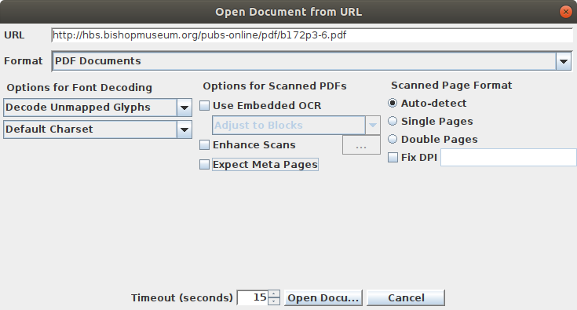
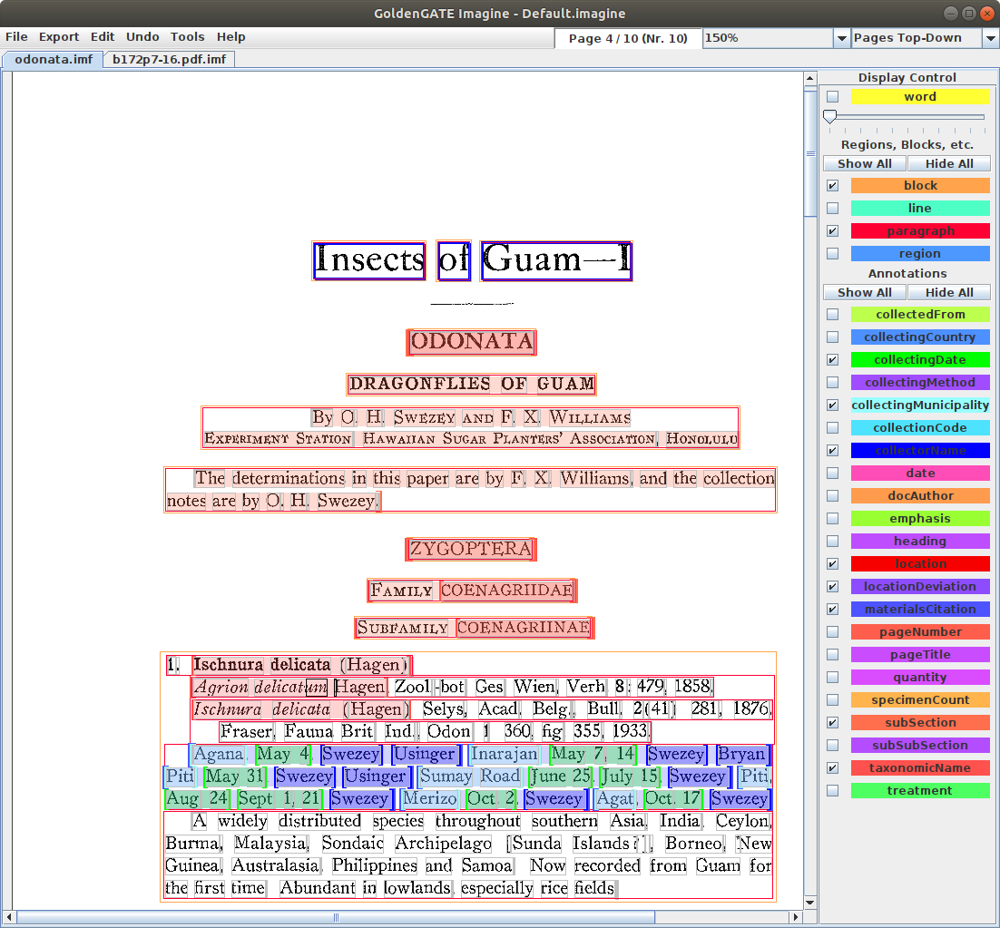

# GGI-odonata

This repo documents my first attempt to annotate an article using GoldenGate Imagine (GGI) following training material available from the [Plazi Community repo](https://github.com/plazi/community). 

## Data acquisition

## Annotation

Currently stuck.

